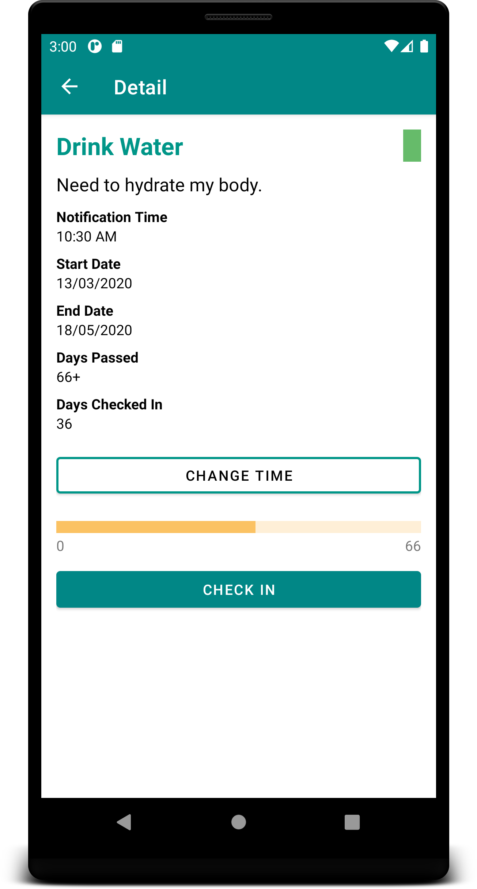
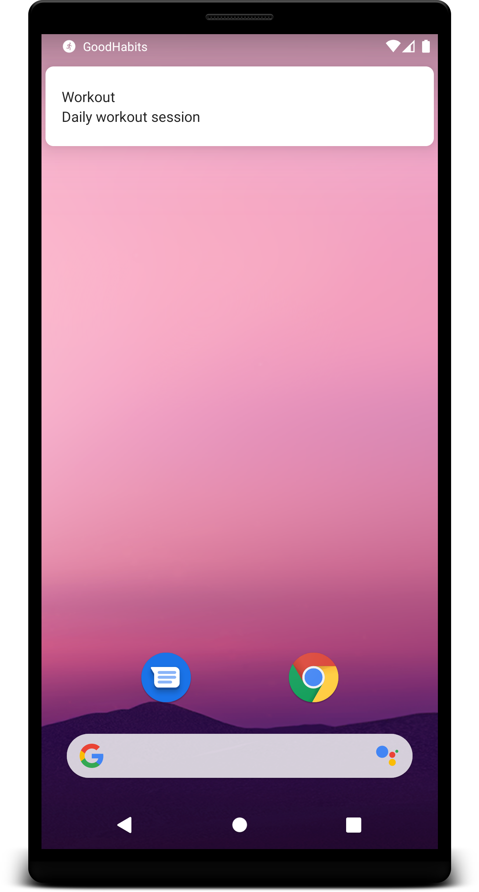

  

<h1 align="center"> GoodHabits </h1>

Good Habits is a habit-tracking application that can be used to develop good habits or get rid of bad habits.The main goal of Good Habits is to make an individual complete the tasks they have created. Each task in this context is a habit that a user wants to start or quit. The application will send out notifications at certain time intervals to keep the users on track. The app will also contain a detailed description of ongoing and past activities or habits a user has performed. To keep the person motivated and focused motivational quotes will be sent as notifications throughout the day. Moreover, it will give users a rating on how they are doing towards a habit so they get a sense of achievement and flaunt it among friends.  

## Features  

Daily qoutes to keep you motivated throughtout the day. | A detail view that shows you the goal progress. | A notification system to help you check in on your goals, in timely manner.
:--------------------------------------------------------------------------------:|:--------------------------------------------------------------------------------:|:--------------------------------------------------------------------------------:
  |   | 
